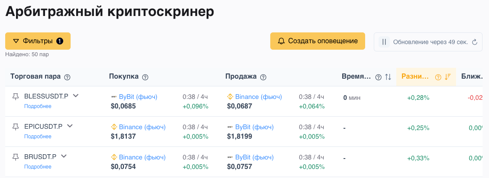
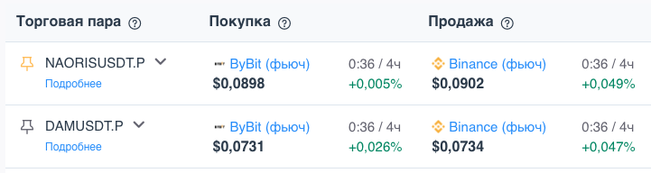
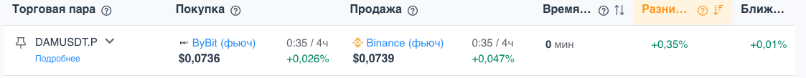
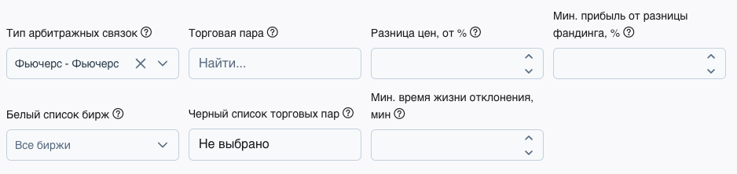
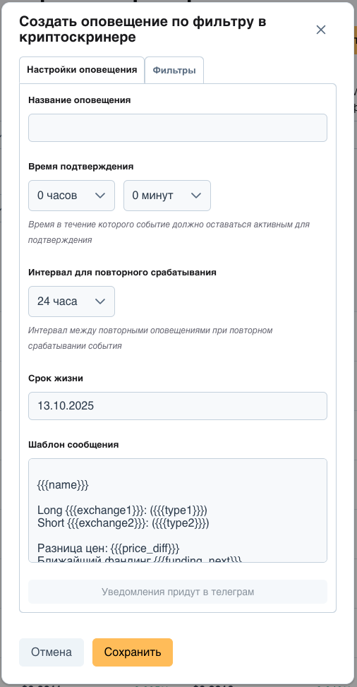
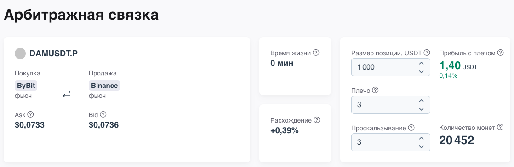
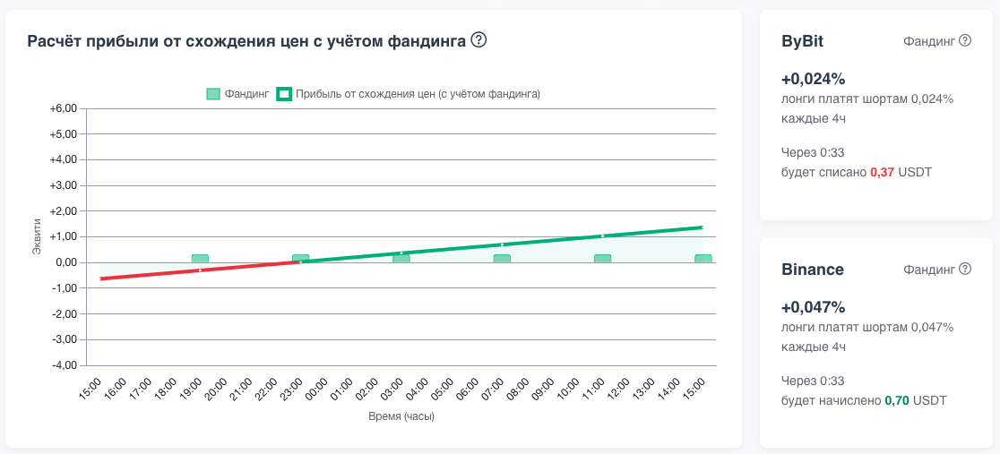
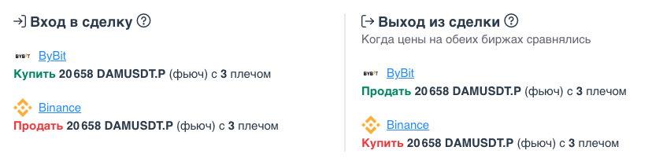
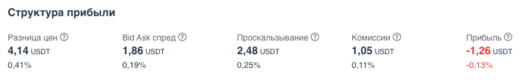
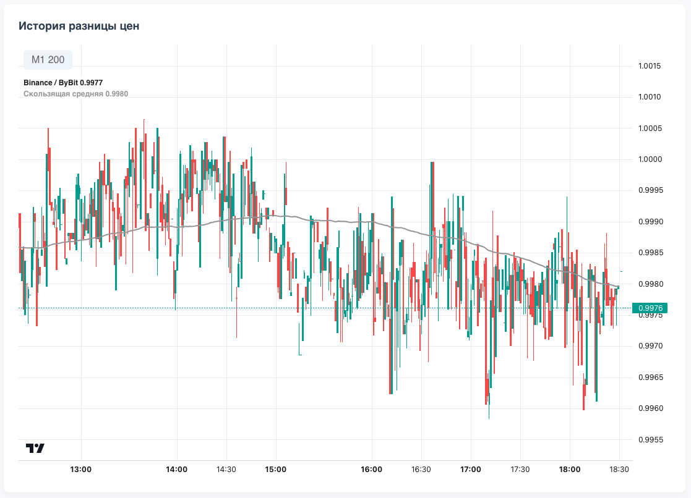

# Экспресс-обзор криптоскринера Spread Insight  

<iframe width="720" height="405" src="https://rutube.ru/play/embed/5638973d16f74cb4d09fe15b3a630552/" style="border: none;" allow="clipboard-write; autoplay" webkitAllowFullScreen mozallowfullscreen allowFullScreen></iframe>

Криптовалюты торгуются на 10-ках бирж, на наиболее ликвидные криптовалюты торгуются фьючерсы и в моменты сильных движений цены конкретного инструмента на разных биржах могут расходиться. Это создает возможности для арбитража. 

Крипто-скринер Spread Insight в настоящий момент позволяет отслеживать и оценивать расхождения для пар фьючерс-фьючерс и спот-фьючерс на разных биржах.

Скринер Spread Insight это продукт компании Финам и для полноценного использования с настройкой оповещений нужно авторизоваться через приложение [FinamTrade](https://trading.finam.ru/). Для этого необязательно иметь счет в Финаме, достаточно и демо-аккаунта.

Посмотрите [статистику отклонений и примеры сделок](/cryptoscreener-lp), выполненных на реальных счетах с помощью криптоскринера.

### Особенности бета-версии

Это бета версия криптоскринера, сейчас к ней подключено только 5 бирж (Binance, ByBit, Kraken, HyperLiquid и Finam). Планируется продолжать подключать биржи и развивать функционал, помогающий оценить перспективнось сделок. Пользование продуктом в статусе беты бесплатное.

### Какие функции есть в скринере
Скринер состоит из таблицы арбитражных связок для отбора интересных возможностей, настраиваемых оповещений в телеграм, чтобы вовремя узнавать о возникших арбитражных возможностях и детальной страницы арбитражной связки для оценки прибыли от арбитражной сделки с учетом начисления и списания фандинга.

### Таблица арбитражных связок

В таблице отображается список из 50 связок с наибольшей разницей цены на разных биржах с учетом заданных фильтров. Цены и информация по фандингу в таблице обновляются в режиме онлайн, а сам список связок обновляется раз в минуту. Связки в таблице можно сортировать по полям со значениями.

Если вы заинтересовались конкретной связкой, то ее можно закрепить, нажав на кнопку в начале строки, чтобы она всегда была наверху таблицы и не перемещалась при её обновлениях.
  
### Параметры связки в таблице

- Название торговой пары
- Биржа покупки с ценой предложения (ask), временем до ближайшего фандинга, периодом и ставкой фандинга
- Биржа продажи с ценой спроса (bid) и параметрами фандинга
- Время жизни расхождения 
- Разница между ценами спроса и предложения в %
- Начисление или списание фандинга в ближайшее время начисления фандинга в процентах от общей суммы позиции. 
- Начисление или списание фандинга в дальнее время начисления фандинга в процентах от общей суммы позиции. Если по обеим биржам период фандинга одинаковый, то значение в ближайшее и дальнее время начисления фандинга будет совпадать.

### Фильтры

Связки можно фильтровать по следующим полям:
- Тип арбитражных связок - поскольку они оцениваются и торгуются по разному
- Торговая пара - можно отфильтровать только связки по конкретной торговой паре
- Разница цен - минимально разумное значение от 0.5%
- Минимальная прибыль от разницы фандинга
- Белый список бирж - чтобы отфильтровать связки только тех бирж на которых у вас например есть аккаунт
- Черный список торговых пар - чтобы отфильтровать те, которые показывают расхождение, но торговать их нельзя, например из-за делистинга
- Минимальное время жизни отклонения - чтобы отсечь пары с мигающим отклонением

### Уведомления

Расхождения возникают неожиданно и часто живут не очень долго. Чтобы успеть войти в сделку, можно настроить уведомление о появлении новой связки, удовлетворяющих установленным фильтрам. Можно настроить несколько уведомлений с разными наборами фильтров. Управлять настроенными уведомлениями можно по нажатию на колокольчик справа вверху.

### Детальная страница связки
Перейти на детальную можно нажав ссылку "подробнее" в таблице связок под названием торговой пары связки. На детальной странице можно достаточно точно оценить прибыль от арбитражной сделки в случае схождения цен с учетом комиссий, проскальзываний и потерях на спреде. Также можно оценить как начисление фандинга будет влиять на прибыль при удержании позиции значительное время.

Справа есть калькулятор арбитражной сделки, где можно задать размер позиции, плечо и проскальзывание и получить оценку прибыли.

Влияние фандинга на прибыль показано в виде графика изменения прибыли с обозначенными моментами начисления фандинга, справа детально указано на какой бирже, сколько и когда будет списано или начислено фандинга на заданную позицию.

Ниже приведены подсказки по сделке - сколько инструмента и на какой бирже нужно купить или продать, чтобы войти и выйти из сделки

Далее приведена структура прибыли для оценки вклада затрат на сделку в итоговую прибыль

На графике истории разницы цен можно оценить развитие отклонения в динамике - как давно оно существует, насколько стабильно, как быстро росло, чтобы решить стоит ли заходить в эту сделку

## Читать далее

- [Что такое фандинг](/crypto/crypto-funding/)
- [Виды арбитража на криптовалютном рынке](/crypto/crypto-pair-types/)

