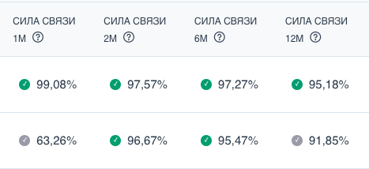

# Скринер арбитражных возможностей

Арбитраж торгуют на парах инструментов, цены которых ходят согласовано, но в
текущий момент сильно отклонились от своего среднего значения. Однако успех
арбитражной сделки зависит от тщательности подбора пары и выбора подходящего
времени для входа в сделку. Скринер помогает трейдеру решить обе задачи.

### Подбор подходящей пары для арбитража

Пару делают подходящей для арбитража следующие факторы:
1. Склонность соотношения цен инструментов пары возвращаться к своему среднему
значению после сильного отклонения. Чем сильнее эта склонность, тем выше
вероятность закрыть сделку в прибыль.
2. Возможность заработать на возврате спреда к среднему с учетом комиссий,
проскальзываний, риска выхода по стоп-лоссу и требований к капиталу.

### Оценка склонности соотношения цен возвращатся к среднему значению

Если цены инструментов большую часть времени изменяются согласованно, то в таких
парах также наблюдается и тенденция возврата к среднему. Для измерения
согласованности цен в статистке существует метод, называемый коинтеграцией. В
скринере для каждой пары посчитана и отображается сила связи за 1, 3, 6 и 12 месяцев.
Сила связи показывает вероятность, что цены коинтегрированы — то есть ходят
согласовано. Считается, что вероятность более 95% означает наличие сильной связи.

В скринере можно выставить фильтры по силе связи в каждом из посчитанных
периодов. Пар, имеющие сильную и постоянную связь немного. Наличие нескольких
периодов позволяет находить не только такие пары, но и те, где коинтеграция
появилась недавно или наоборот раньше была, но пропала в последнем месяце.

Кроме статистики, можно еще довериться фундаментальной оценке связанности цен в паре. В скринере можно выставить фильтр по типу связи, выбрав инструменты, [относящиеся к одной отрасли](/ideas/para-one-industry/) и даже уточнить отрасль фильтром по индустрии. Используя фильтр по тикеру, также можно оценить [пары из компаний с общим владельцем](/ideas/trading-idea-common-owner/) или из [обычных и привилегированных акций одной компании](/ideas/priviledges/).

### Оценка возможности заработать на возврате спреда к среднему
Прибыльность сделки можно оценить через показатель потенциала прибыли и
значение чистой прибыли для указанного размера позиции.

**Потенциал прибыли** показывает, сколько % от капитала можно заработать, если
соотношение цен вернется к своему среднему значению без учета комиссии. Это оценка сверху потенциала сделки и способ быстро отфильтровать недостаточно прибыльные
возможности. В реальности стоит рассчитывать на половину от этого значения в
качестве прибыли. Если оно вас не устраивает, стоит выбрать другую пару. По этому
полю можно настроить фильтр, ограничив диапазон значений.

**Размер капитала и чистая прибыль** позволяет оценить влияние комиссий на сделку.
Если мы используем акции, то комиссии могут «съесть» всю прибыль от арбитражной
сделки. Доходность сделки можно повысысить, увеличивая капитал. Алгоритм
подбирает минимальный размер капитала, который обеспечивает положительный
результат сделки с учетом комиссий.

Вы можете настроить фильтр по размеру капитала, который вы готовы задействовать в
арбитражной сделке. Для расчета размера капитала по фьючерсам используется
полный размер позиции. При торговле фьючерсами на счете блокируется гарантийное
обеспечение, которое меньше размера позиции в 3-5 раз, что стоит учитывать при
оценке как прибыльности, так и размере капитала при торговле фьючерсами.

### Выбор подходящего типа инструмента

На платформе Spread Insight представлены ликвидные акции и фьючерсы на акции,
индексы, валюту и ресурсы. В скринере вы можете отфильтровать нужные
инструменты фильтром “Тип инструмента”. У каждого инструмента свои особенности:

**Фьючерсы**: требуют меньше капитала, короткие продажи не сложнее обычных покупок
и не предполагают платы за перенос позиций. Комиссии низкие и фиксированные, что
позволяет чаще торговать небольшими объемами. Однако большинство фьючерсов
срочные, поэтому активны только ближайшие к экспирации контракты.
Следовательно, результаты бэктестов и даже виртуальной торговли долгосрочными
фьючерсами могут быть нерелевантны.

**Акции**: имеют стабильную ликвидность и надежные результаты бэктестов. Однако
комиссии выше, требуется больше капитала, а при переносе позиции берется плата за
маржинальное кредитование.

Торговля парой «акция против фьючерса» сложнее и рекомендуется только опытным
трейдерам. Начинающим стоит выбирать пары из акций или фьючерсов с ближайшей
датой экспирации.

### Выбор подходящего времени для входа в сделку

Для отбора пар с удачным моментом входа подходит поле **Размер отклонения**, по которму можно настроить фильтр на диапазон значений.  Размер отклонения выражается в [стандартных отклонениях](/stat-arbitrage/std/). Опытные трейдеры имеют свою шкалу значимости отклонений, но для большинства случаев подходит деление отклонений на сильное, умеренное и слабое. 
- **Сильное отклонение** - выше 3 сигм, редкое событие, последствия которого сложно оценить, торговать такие отклонения нужно с осторожностью, хоть они и обладают большим потенциалом
- **Умеренное отклонение** от 2 до 3 сигм, означает высокую вероятность возврата к среднему, то есть вероятность закрыть сделку в прибыль
- **Слабое отклонение** менее 2 сигм, означает отсутствие определенного прогноза дальнейшего движения спреда

Выставленные фильтры сохраняются и не теряются при перезагрузке страницы. Таблицу пар можно сортировать по любому столбцу кликом по нему.

После настройки фильтров и получения списка подходящих пар для уточнения вероятности и прибыльности арбитражной сделки можно по клику на пару перейти в [бэктестер](/start/backtester/) и изучить её потенциал более продробно.

## Читать далее

- [Как оценить доходность арбитражной сделки с помощью бэктестера](/start/backtester/)
- [Использование коинтеграции для поиска арбитражных пар](/stat-arbitrage/find/)

