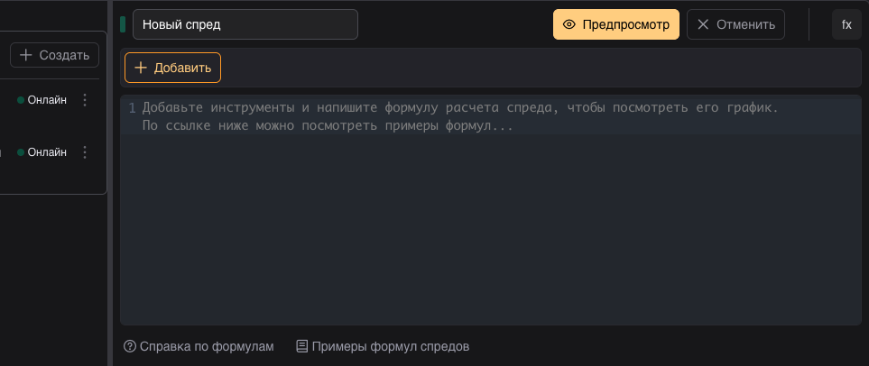
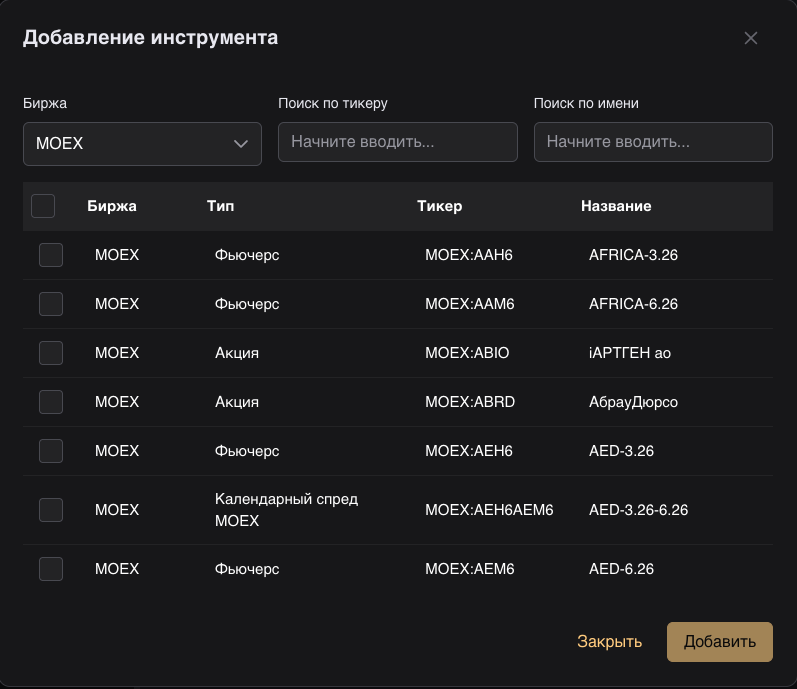
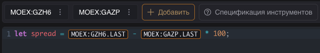
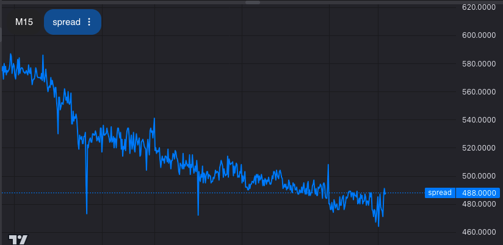
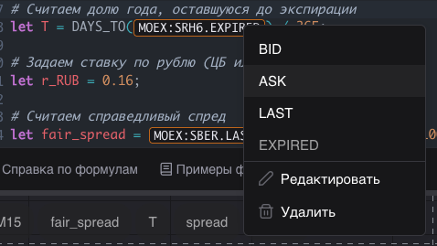
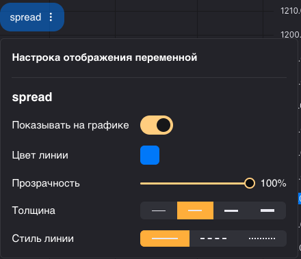

# Экспресс обзор конструктора спредов

<iframe width="720" height="405"
        src="https://rutube.ru/play/embed/9a380ad1654eb9b4a0209e9fcd7433fb"
        style="border: none;"
        allow="clipboard-write; autoplay"
        allowFullScreen
      ></iframe>

    

Практика показывает, что самые стабильные заработки трейдерам обеспечивает классический арбитраж на рынках MOEX, CME и FOREX.. Правила составления спреда отличаются для разных инструментов и могут отличаться от трейдера к трейдеру, поэтому единый скринер сделать сложно. 

Трейдеры сейчас пользуются спредовыми графиками в TradingView и экселевскими таблицами. В то же время в арбитраже много нюансов, которые сложно учесть в этих инструментах. А без учета они приводят к ошибкам и потерям денег.

Мы сделали конструктор спредов, в котором каждый трейдер может собрать спреды по формулам, так как сам считает нужным. Собрать себе индивидуальный скринер, настроить уведомления, поделиться с коллегами или своей аудиторией.

### Как пользоваться конструктором спредов
Создаете новый спред, выбираете инструменты, составляете из них формулу спреда и сохраняете спред. После создания спред начинает рассчитываться в режиме онлайн по текущим котировкам. Выбрав спред, можно посмотреть на его график. Впоследствии можно будет настроить уведомления на выполнение заданных условий по спреду.

### Страница конструктора спредов
Страница конструктора спредов состоит из списка спредов в левой части и области спреда в правой. Область спреда поделена на редактор формул и график спреда. 

### Создание своего спреда

Если у вас еще нет собранных спредов, то при переходе на страницу конструктора спредов вы попадете в режим создания нового спреда. Если есть, то нажмите кнопку “Создать” слева над списком спредов.

Добавьте торговые инструменты, из которых вы хотите собрать спред, нажав кнопку “Добавить” над редактором формул. Например, выберите на бирже MOEX фьючерс на акции газпром GZH6 и сами акции GAZP.

В редакторе формул:
- Напишите “let srpead =” 
- Кликом по инструменту GZH6 над редактором откройте меню инструмента и выберите “Добавить LAST”. В формулу добавиться цена последней сделки по фьючерсу GZH6.
- Напишите “-” чтобы построить спред разницы цен (difference) 
- Кликом по инструменту GAZP над редактором откройте меню инструмента и выберите “Добавить LAST”.
- Напишите “* 100” чтобы умножить цену акции на 100, чтобы нормировать её относительно цены фьючерса, поскольку один контракт фьючерса содержит 100 акций.
- Завершите выражение точкой с запятой “;”
- Нажмите слева вверху кнопку “Предпросмотр”

Под редактором формул появиться график спреда. 

Сохраните свой спред, нажав кнопку “сохранить” или “сохранить как” над редактором формул. Сохранять среды могут только авторизованные пользователи. Авторизоваться в  Spread Insight можно через приложение FinamTrade, это просто и бесплатно. Если у вас возникли сложности с авторизацией, обратитесь в онлайн консультант.

Под редактором формул есть справка по формулам и примеры формул популярных спредов, которые показывают, как можно использовать формулы для построения своих спредов.

### Управление инструментами спреда
Кроме добавления инструментов в спред также доступна возможность замены всех вхождений инструмента в формуле (полезна при роллировании фьючерсов), удаления и просмотра спецификации всех инструментов.

Каждый инструмент в формуле также можно удалить и заменить. Для этого в режиме редактирования кликните правой кнопкой мыши по инструменту в формуле, чтобы показать меню действий с ним.

### График спреда
График спреда строиться в виде линии по ценам закрытия в выбранном таймфрейме, который можно выбрать в левом верхнем углу графика. 

На график выводятся все заданные в формуле переменные. Для каждой переменной можно включить/выключить ее отображение на графике и настроить стиль линии. Для этого нажмите на название переменной вверху графика для показа панели настроек отображения.

Для сохраненных спредов в режиме “онлайн” график среда достраивается в реальном времени по мере прихода новых котировок.

### Список спредов
Авторизованные пользователи имеют возможность сохранять спреды в свою коллекцию. Свой список спредов отображается слева. 

### Ограничения бета-версии
Текущая версия дает возможность только собирать спреды и анализировать их графики, в ближайших планах добавить возможность делиться спредами, добавление новых инструментов, возможность оценки прибыли с учетом комиссий, бэктест на истории и AI-ассистента для поиска арбитражных идей.

Если инструмент заинтересовал, но вам не хватает какого-то функционала, поделитесь с нами. Свяжитесь с нами через онлайн консультант.
 
[Попробовать конструктор спредов](/constructor)
